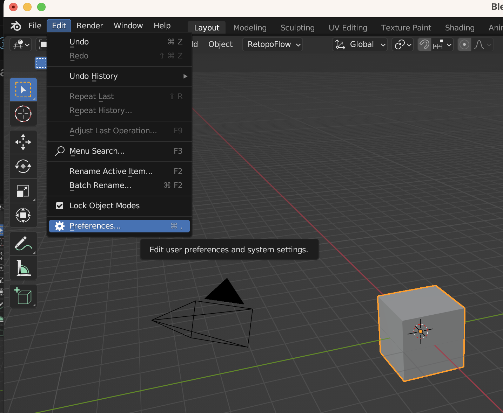
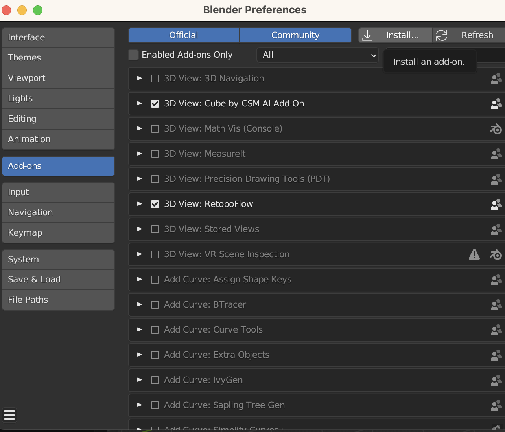
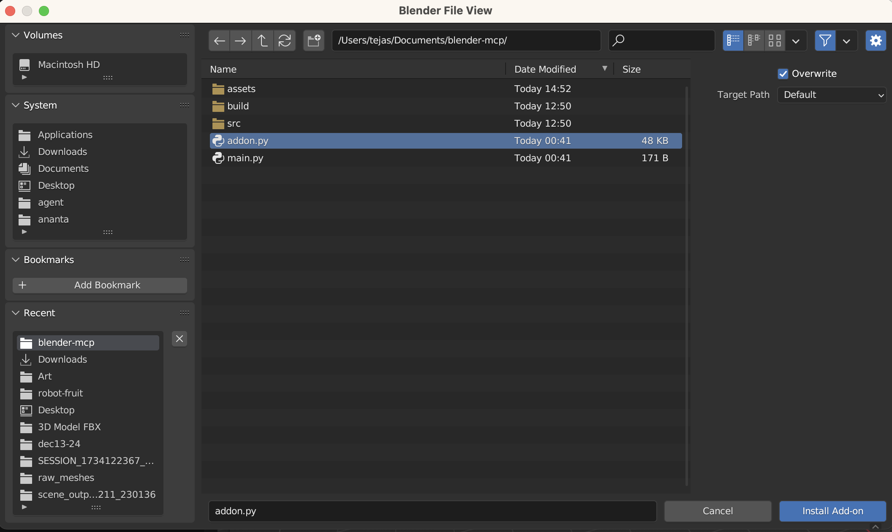
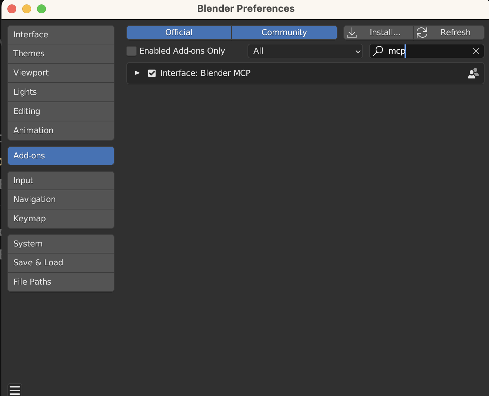
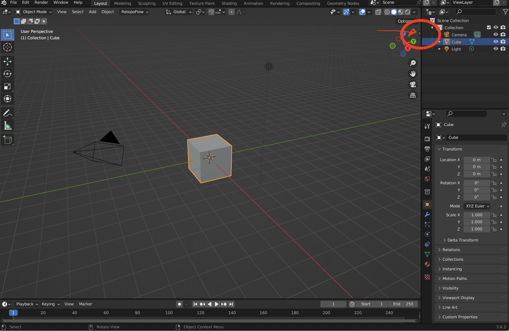
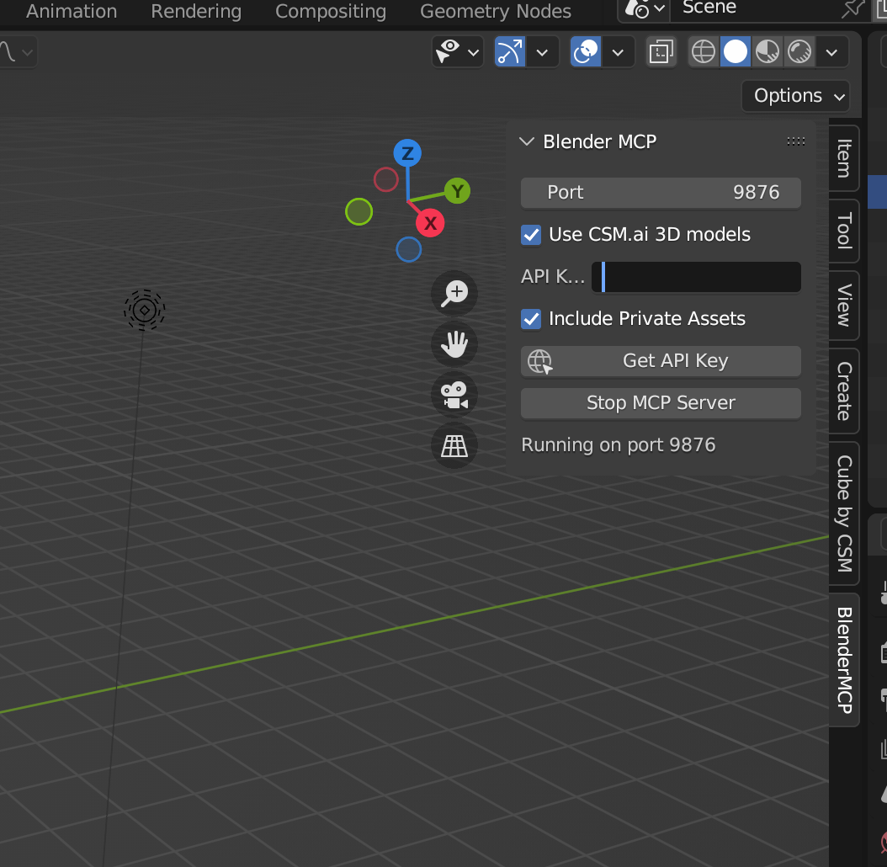

# BlenderMCP x CSM.ai x LLM Agents (e.g. Cursor / Claude)

Connect Blender, CSM.ai and LLMs via the Model Context Protocol (MCP). This integration enables text and image based editing capabilities in Blender.

```
      ╭───────────╮       ╭───────────╮       ╭───────────╮
      │  CSM.ai   │◄━━━━━►│  Blender  │◄━━━━━►│  MCP UI   │
      │ 3D Assets │       │    MCP    │       │e.g.Cursor │
      ╰─────┬─────╯       ╰─────┬─────╯       ╰─────┬─────╯
            │                   │                   │
            ▼                   ▼                   ▼
      ╭─────────────────────────────────────────────────╮
      │                                                 │
      │               BLENDER ENGINE                    │
      │        Creative 3D Modeling Environment         │
      │                                                 │
      ╰─────────────────────────────────────────────────╯
```

https://github.com/user-attachments/assets/496c2c69-4779-4569-9be0-80b767702c4c

## Overview

BlenderMCP creates a bridge between Blender, CSM.ai and language models, allowing for powerful AI-assisted 3D modeling workflows.

## MCP Feature List ✨

- 🔍 Ability to quickly search from public or private CSM.ai sessions. This allows interactive MCP based development.

- 🏃 For any humanoid like mesh in the scene, ability to animate given a text prompt (from a fixed library set)

## Installation

1. Clone the repository:
   ```bash
   git clone https://github.com/CommonSenseMachines/blender-mcp.git
   ```

2. Navigate to the project directory:
   ```bash
   cd blender-mcp
   ```

3. Install the package in development mode:
   ```bash
   pip install -e .
   ```

## Cursor Configuration

1. Open Cursor
2. Navigate to: `Cursor → Settings → Cursor Settings → MCP → Add a new server`
3. Add the following MCP configuration (see .mcp.json file):

```json
{
    "mcpServers": {
        "blender": {
            "command": "python",
            "args": [
                "-m", "blender_mcp.server"
            ]
        }
    }
}
```

## Blender Configuration

1. Launch Blender
2. Navigate to `Edit → Preferences`  
3. Install the `addon.py` file from this repository 
4. Verify that the Blender MCP addon appears in your addon list 
5. Start the MCP server and enable the 'Use CSM.ai 3D models' option  
6. Enter your CSM API key to begin using the integration with Cursor

## CSM.ai Integration

For optimal performance, the MCP server utilizes vector search-based 3D model retrieval. To enhance your experience:

1. Visit [3d.csm.ai](https://3d.csm.ai) to create relevant modeling sessions
2. These sessions will provide targeted 3D assets for your specific projects
3. Alternatively, the system can access a large collection of general 3D models

This workflow creates a powerful ecosystem where:
- CSM.ai functions as your asset generator and manager
- Cursor serves as your AI coding assistant
- Blender operates as your execution environment


Instead of Cursor you can also use other MCP clients like the Claude Desktop App. See instructions in: [Blender MCP](https://github.com/sponsors/ahujasid). You will use the same mcp.json file as above but just enter it in the claude desktop UI.

## Acknowledgements

[Blender MCP](https://github.com/sponsors/ahujasid)
