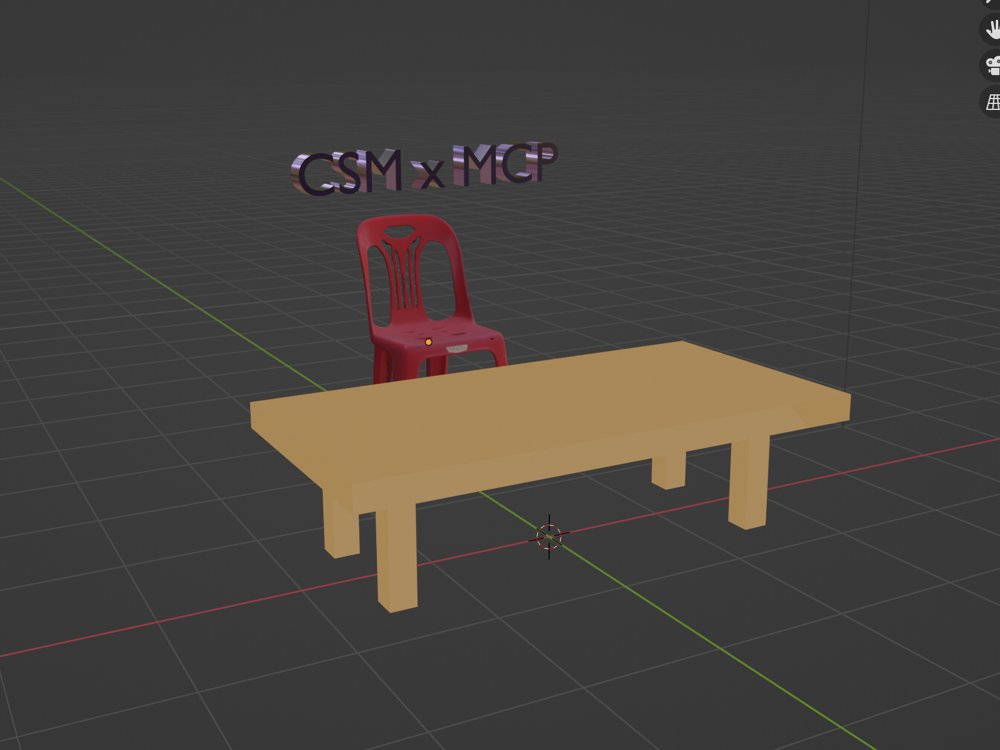

# BlenderMCP x CSM.ai x LLM Agents (e.g. Cursor / Claude)

Connect Blender, CSM.ai and LLMs via the Model Context Protocol (MCP). This integration enables text and image based editing capabilities in Blender.

```
      ╭───────────╮       ╭───────────╮       ╭───────────╮
      │  CSM.ai   │◄━━━━━►│  Blender  │◄━━━━━►│  MCP UI   │
      │ 3D Assets │       │    MCP    │       │e.g.Cursor │
      ╰─────┬─────╯       ╰─────┬─────╯       ╰─────┬─────╯
            │                   │                   │
            ▼                   ▼                   ▼
      ╭─────────────────────────────────────────────────╮
      │                                                 │
      │               BLENDER ENGINE                    │
      │        Creative 3D Modeling Environment         │
      │                                                 │
      ╰─────────────────────────────────────────────────╯
```

https://github.com/user-attachments/assets/496c2c69-4779-4569-9be0-80b767702c4c

## Overview

BlenderMCP creates a bridge between Blender, CSM.ai and language models, allowing for powerful AI-assisted 3D modeling workflows.

## MCP Feature List ✨

- 🔍 Ability to quickly search from public or private CSM.ai sessions. This allows interactive MCP based development. E.g. "Use CSM to get me a ghibli robot". Make sure you have some pre-generated robots on [3d.csm.ai](https://3d.csm.ai) or it will use some public session.

- 🏃 For any humanoid like mesh in the scene, ability to animate given a Mixamo file for maximum controllability. Here's an example (first name the mesh to animate, then the system will ask you for a local file path from Mixamo and instructions): [MCP Animation Workflow](assets/animate_tut.png)

## Installation

1. Clone the repository:
   ```bash
   git clone https://github.com/CommonSenseMachines/blender-mcp.git
   ```

2. Navigate to the project directory:
   ```bash
   cd blender-mcp
   ```

3. Install the package:
   ```bash
   pip install -e .
   ```

### Troubleshooting

- Upgrade pip
- Use `python3.10 -m pip install -e .` if you don't normally use python

## Cursor Configuration

1. Open Cursor in the root directory of the cloned blender-mcp repo. 
2. Navigate to: `Cursor → Settings → Cursor Settings → MCP → Add a new server`
3. Add the following MCP configuration (see .mcp.json file):

```json
{
    "mcpServers": {
        "blender": {
            "command": "python",
            "args": [
                "-m", "blender_mcp.server"
            ]
        }
    }
}
```

### Troubleshooting

- Use Cursor from the blender-mcp directory
- Use `python3.10` in mcp.json (or whatever your normal Blender Python version is)

## Blender Configuration

1. Launch Blender
2. Navigate to `Edit → Preferences`  
3. Install the `addon.py` file from this repository 
4. Verify that the Blender MCP addon appears in your addon list 
5. Start the MCP server and enable the 'Use CSM.ai 3D models' option  
6. Enter your CSM API key to begin using the integration with Cursor

### Troubleshooting

- In Ubuntu, you may have to `sudo apt install blender`.

## CSM.ai Integration

For optimal performance, the MCP server utilizes vector search-based 3D model retrieval. To enhance your experience:

1. Visit [3d.csm.ai](https://3d.csm.ai) to create relevant modeling sessions
2. These sessions will provide targeted 3D assets for your specific projects
3. Alternatively, the system can access a large collection of general 3D models

This workflow creates a powerful ecosystem where:
- CSM.ai functions as your asset generator and manager
- Cursor serves as your AI coding assistant
- Blender operates as your execution environment


## Quickstart / Try It Out

Once you have entered your CSM API key in the Blender addon settings and confirmed the MCP server is running (check `Cursor Settings → MCP`), you're ready to test the integration!

Simply open a new chat window in Cursor (with any project open) and paste the following prompt:

```prompt
First, make sure to clear the scene. Then create a simple table just using blender, do no search for that. Once the table has been crafted, search for a chair on CSM AI, add it to the scene and place it next to the table. Then spell out the word "CSM x MCP" above the CSM asset, color it in #A157EE and make it very shiny metallic and rotate it 90deg so that it makes for a nice display facing the user. Also ensure that the table has nice textures.
```

This will trigger actions in Blender based on your instructions. The result from using the above prompt should look like this:



Instead of Cursor you can also use other MCP clients like the Claude Desktop App. See instructions in: [Blender MCP](https://github.com/sponsors/ahujasid). You will use the same mcp.json file as above but just enter it in the claude desktop UI. 

## Python Test Client

The repository includes a standalone Python client (`chat_client.py`) that demonstrates how to connect to the Blender MCP server programmatically. This is useful for:

- Testing the Blender MCP connection without using Cursor or Claude Desktop
- Understanding the MCP protocol and API
- Developing your own custom MCP clients
- Debugging MCP server responses

### Running the Python Client

1. Start Blender and enable the MCP addon as described in the "Blender Configuration" section.
2. Open a terminal in the repository root and run:

   ```bash
   python chat_client.py
   ```

### Client Features

The Python client connects to Blender via the Model Context Protocol and demonstrates several capabilities:

- Lists all available MCP tools organized by category (query, creation, modification, etc.)
- Retrieves and displays scene information from Blender
- Creates a simple cube in the scene
- Gets detailed information about the created object
- Checks CSM.ai integration status

### Extending the Client

The client demonstrates how to work with the MCP format and handle various response types. You can use it as a starting point to:

- Create scripts that automate Blender tasks
- Build custom UIs on top of Blender's MCP capabilities
- Integrate Blender with your own applications

The code includes helper functions for extracting text from MCP responses and parsing JSON content, making it easy to work with the returned data.

## Acknowledgements

[Blender MCP](https://github.com/sponsors/ahujasid)
